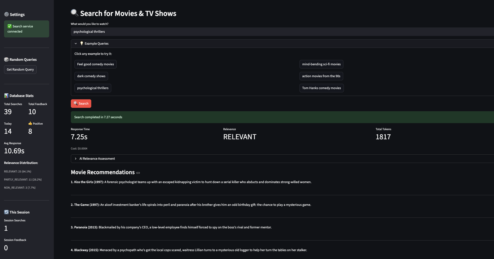
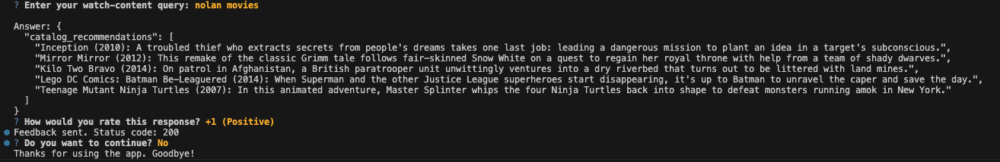
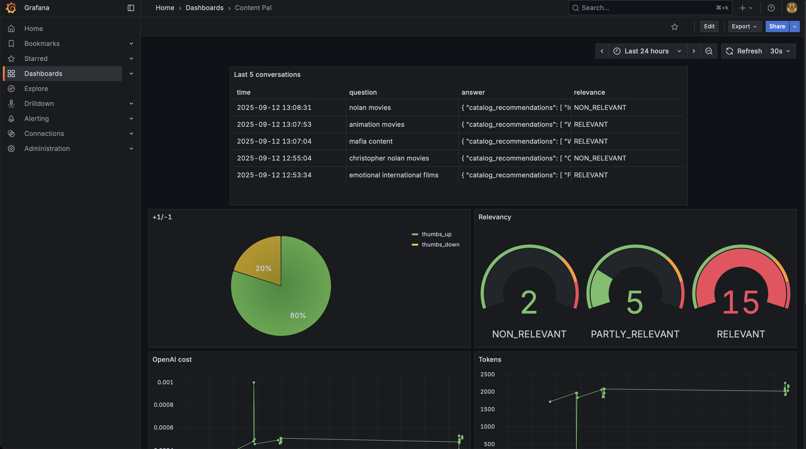

# Content Pal
A smart streaming content assistant to help users find what movies or tv-shows to watch and obtain adhoc recommendations from a search-chat interface using Retrieval-Augmented Generation (RAG) techniques. 

### Data
The content data is obtained from Kaggle Netflix Movies and TV shows. A user can search for movies or tv-shows available in the catalog based on various attributes like genre, director, cast, release year, etc.


Data Source: [Kaggle Netflix Movies and TV Shows](https://www.kaggle.com/datasets/shivamb/netflix-shows)


## High-Level Architecture


### Workflow: 
- Ingest the data and index it into a search engine (minsearch or opensearch)
- Use a combination of keyword-based and semantic search to retrieve relevant documents based on user queries
- Use a Large Language Model (LLM) to generate responses based on the retrieved documents and user query
- Provide an API endpoint to interact with the system and get recommendations


## Setup

### Installation 

**Prerequisites**: Python 3.11 or higher

**Package Manager**: pipenv (in case of any others the instructions need to change accordingly)

Clone the repository
```zsh
git clone https://github.com/nupsea/content-pal.git
```

> Install the required libraries.

```zsh
cd content-pal  # Navigate to the project directory
pipenv install openai scikit-learn pandas flask minsearch opensearch-py sentence-transformers psycopg2-binary sqlalchemy sqlalchemy-utils python-multipart flask-cors gunicorn streamlit

pipenv install --dev tqdm ipywidgets python-dotenv pgcli ipykernel
pipenv lock

```


## Running the Application

The entire application can be run using Docker and Docker-Compose.
Make sure you have Docker and Docker-Compose installed on your machine.
> Note: Replace the docker-compose.yml with docker-compose-with-os.yml if you want to use opensearch as the search engine option.

### Environment Variables
Create a `.env` file in the root directory and copy the structure of `.env_template`. Update the values accordingly.
```zsh
cp .env_template .env
# Update the values in .env file (mostly the OPENAI_API_KEY and OPENSEARCH_PASSWORD)
```


### DB Configuration
Initial setup 
```zsh
docker-compose up -d
```
Open a separate terminal, Run the DB preparation script to create the necessary tables and run the Flask app for the first time to initialize the ingestion and indexing.
```zsh
cd content-pal  # Ensure you are in the project directory
source .env 
pipenv run python -m src.modules.workflow.db_prep
pipenv run python -m src.modules.workflow.app 

```

### Running with Streamlit UI

This is the easiest way to interact, experiment and test the application.
You can run the Streamlit UI locally using the following command being in the root directory:
```zsh
./stop_all.sh  # To stop any existing instances
./start_all.sh # To start the application stack
```
and access **Streamlit UI**: http://localhost:8501




### Running with Docker Compose (Optional)

This should bring up the entire application stack including Opensearch and the Flask app.
- Appliction (port 5001)
- Opensearch (port 9200) # optional
- Opensearch Dashboards (port 5601) # optional
- Postgres (port 5432)
- Grafana (port 3000)


```zsh
source .env && docker-compose up -d

docker logs -f <container_id>  # To check the logs of the application

```

### Running with Docker without docker-compose (Optional)

If you need to change some environment variables, you can do so in the `.env` file and
correspondingly build DockerFile. 

```zsh
docker build -t content-pal .

source .env && 
docker run -it --rm \
  -e OPENAI_API_KEY=$OPENAI_API_KEY \
  -e DATA_PATH="data/netflix_titles_enriched_full.csv" \
  -p 5001:5000 \
  content-pal
```

### Testing (Optional)

#### API Endpoint
You can test the API using curl or any API client like Postman.
```zsh
curl -X POST "http://localhost:5001/recommend" -H "Content-Type: application/json" -d '{"query": "Recommend me some sci-fi movies"}'

"{\n  \"catalog_recommendations\": [\n    \"The Box (2009): A couple must decide whether to push a button that will net them a million dollars but that will also cause the death of a complete stranger.\",\n    \"Knowing (2009): An MIT astrophysics professor and his son unearth a string of numbers from a time capsule that seem to reveal a cataclysm that will wipe out humanity.\",\n    \"Level 16 (2018): In a bleak academy that teaches girls the virtues of passivity, two students uncover the ghastly purpose behind their training and resolve to escape.\",\n    \"3022 (2019): Stranded when the Earth is suddenly destroyed in a mysterious cataclysm, the astronauts aboard a marooned space station slowly lose their minds.\",\n    \"2012 (2009): When a flood of natural disasters begins to destroy the world, a divorced dad desperately tries to save his family by outrunning the cataclysmic chaos.\"\n  ]\n}"
```

#### Script to test the API
Or Alternatively, you can use the provided `test.py` script to test the API.
```zsh
pipenv run python -m src.modules.workflow.test -p 5001
User Query: Tom Cruise movies
Making request to http://127.0.0.1:5001/recommend...

Response status: 200
Success! Response:
"{\n  \"catalog_recommendations\": [\n    \"Rain Man (1988): Motivated by money, a selfish workaholic seeking a piece of his late father's inheritance takes a life-changing road trip with his estranged brother.\",\n    \"Magnolia (1999): Through chance, history and divine intervention, a cast of eclectic characters weaves and warps through each other's lives on a random day in California.\",\n    \"Tom Papa: You're Doing Great! (2020): Comedian Tom Papa takes on body image issues, social media, pets, Staten Island, the 'old days' and more in a special from his home state of New Jersey.\",\n    \"Tom and Jerry: The Magic Ring (2001): When a young wizard leaves Tom to guard his priceless magic ring, Jerry gets the ring stuck on his head, igniting a series of slapstick antics.\",\n    \"Hotel Transylvania 3: Summer Vacation (2018): It's love at first sight for Dracula when he meets Ericka, the charming but mysterious captain of the monster cruise that Mavis plans for the family.\"\n  ]\n}"
```


#### CLI App to test

```zsh
pipenv run python -m src.modules.workflow.cli

# or to randomly get queries from a predefined list
pipenv run python -m src.modules.workflow.cli --random

```


## Ingestion and Indexing

The ingestion script is part of `src/modules/workflow/ingest.py` for the simple minsearch based ingestion.

Since we use an in-memory database, minsearch, as our knowledge base, we run the ingestion script at the startup of the application.
It's executed inside `src/modules/workflow/rag.py` when we import it.


The ingestion script reads the data from the CSV file, processes it, and indexes it into the available search engines.


## Evaluation

### Retrieval Evaluation

Initially evaluated the search results with basic search engines (minsearch and opensearch) and then used both keyword based and vector based search using BM25 and ANN (Approximate Nearest Neighbors) based search.
Refer `notebooks/analysis.ipynb` for details.


Later in order to improve the search quality, used pretraining models and cross-encoders to rerank the results. Also, used different strategies and combinations to acheive better results.

```zsh
❯ pipenv run python src/run_clean_evaluation.py
Loading .env environment variables...
CLEAN COMPREHENSIVE EVALUATION
============================================================
[OK] Loaded ground truth: 1000 unique assets
[OK] Created evaluation subset: 200 assets
..


SchemaAwareSemanticSearch:
  Total Queries: 500
  Successful Queries: 500
  Hit Rate @ 10: 38.0%
  MRR @ 10: 26.5%
  Avg Query Time: 4588.4ms

SimpleEffectiveSearch:
  Total Queries: 500
  Successful Queries: 500
  Hit Rate @ 10: 32.6%
  MRR @ 10: 22.0%
  Avg Query Time: 1164.0ms

UltraBoostSearch:
  Total Queries: 500
  Successful Queries: 500
  Hit Rate @ 10: 34.6%
  MRR @ 10: 23.5%
  Avg Query Time: 4016.9ms

```

### RAG Flow Evaluation

Used LLM-as-a-Judge metric to evaluate the content results.

Among 100 sampled queries, obtained:

* RELEVANT:         48%
* PARTIAL_RELEVANT: 39%
* NOT_RELEVANT:     13% 

Refer `notebooks/rag_flow.ipynb` for details.


## Monitoring

You can monitor the usage and feedback of responses using Grafana dashboards.
http://localhost:3000 (admin/admin) default creds or the ones set in the .env file.



To check and debug the Postgres DB, you can use `pgcli` or any other Postgres client.

```zsh
pipenv run pgcli -h localhost -U postgres -d content_pal -W      
```

Besides, you can also see few monitoring metrics in the Streamlit UI itself.

## References & Acknowledgements
Thanks to the learnings from DataTalks.Club and the various open source libraries and tools that made this possible
https://datatalks.club/courses/llm-zoomcamp/ 

